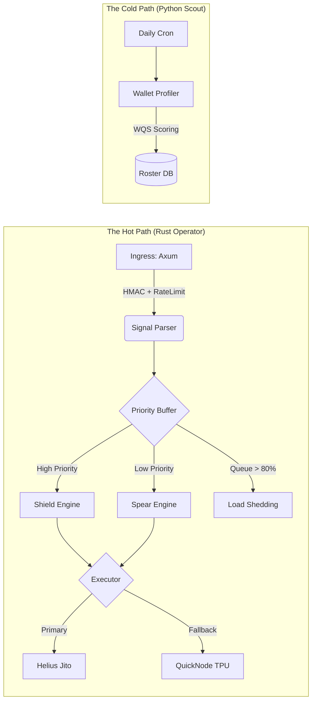

<h1 align="center">Project Chimera</h1>

<p align="center">
  <strong>High-Frequency, Fault-Tolerant Financial Platform for Solana</strong>
  <br />
  <em>Barbell Strategy Execution • < 5ms Internal Latency • Institutional Grade Resilience</em>
</p>

<p align="center">
    <a href="#"></a>
    <a href="#"></a>
    <a href="#"></a>
    <a href="#"></a>
</p>

---

## ⚠️ Infrastructure Latency Warning

**Critical:** Chimera is a High-Frequency Trading (HFT) system. Physical location matters.
*   **Do not run this from Hetzner Falkenstein or Helsinki.** The 100ms roundtrip latency to US-East RPCs defeats the internal optimization.
*   **Requirement:** Servers must be located in **Ashburn, VA (US-East)** or **Amsterdam**.
*   **Recommended Providers:** Latitude.sh, Cherry Servers, or Hetzner (Ashburn DC only).
*   **Verification:** `ping -c 10 <helius-endpoint>` must yield **< 50ms** before deploying the Spear strategy.

---

## 🛡️ The Philosophy: The Barbell Strategy

Chimera is not a simple "copy-bot." It is an automated financial platform that manages risk using a **Barbell Strategy**—balancing extreme safety with extreme upside.

1.  **🛡️ The Shield (Capital Preservation):** 
    *   **Focus:** Low-risk, high-consistency trades.
    *   **Behavior:** Copies proven "Alpha Hunters" with strict stop-losses and liquidity checks.
    *   **Goal:** Grind small, consistent profits to cover operational costs (OpEx) and protect the principal.

2.  **⚔️ The Spear (Asymmetric Upside):** 
    *   **Focus:** High-risk, high-reward opportunities.
    *   **Behavior:** Activates only on high-conviction signals (e.g., Insider Clusters, Momentum Breakouts) using Jito Bundles for guaranteed inclusion.
    *   **Goal:** Hunt for 50x-100x outliers.
    *   **Safety:** Automatically disabled if the system detects RPC instability or consecutive losses.

---

## 🏗️ System Architecture

Chimera v7.1 utilizes a **Hot/Cold** architecture. The Rust Operator handles sub-millisecond execution, while the Python Scout handles heavy data analysis offline.



### Key Components

*   **The Ingress (Rust):** Provides DDoS protection, HMAC signature verification, and Replay Attack prevention.
*   **The Executor (Rust):** Smart routing between Jito Bundles (MEV protection) and standard TPU transactions based on network health. Includes "Stuck State" recovery logic.
*   **The Scout (Python):** Calculates **Wallet Quality Score (WQS) v2** and runs pre-promotion backtests with historical liquidity validation.
*   **The Vault:** AES-256 encrypted storage for private keys; secrets are never held in plaintext config files.

---

## ✨ v7.1 Feature Set

### 🔒 Security & Safety
*   **TokenParser:** Pre-trade analysis to reject **Honeypots**, tokens with **Freeze Authority**, or **Mint Authority**. Implements a Fast/Slow path pattern to minimize latency.
*   **Circuit Breakers:** Automatic trading halts if `max_loss_24h` or `max_drawdown` thresholds are breached.
*   **Idempotency:** Deterministic UUID generation prevents double-buying during webhook retries.

### ⚡ Resilience
*   **Priority Queuing:** Drops "Spear" signals first during high load to preserve "Shield" and "Exit" throughput.
*   **RPC Failover:** Auto-switches from Helius to QuickNode/Triton if latency exceeds 2s.
*   **Self-Healing:** Database write-lock mitigation via WAL mode and SQL-level merge strategies.

### 📊 Compliance & Ops
*   **Reconciliation:** Daily audit processes that compare Database State vs. On-Chain State to detect discrepancies.
*   **Audit Logs:** Immutable logs for every configuration change (`config_audit`) and failed operation (`dead_letter_queue`).
*   **Dashboard:** Real-time web interface for monitoring PnL, active positions, and managing the wallet roster.

---

## 🛠️ Tech Stack

*   **Core:** Rust (Tokio, Axum, Tower-Governor)
*   **Database:** SQLite (WAL Mode, SQLx)
*   **Intelligence:** Python 3.11 (Pandas, Numpy)
*   **Blockchain:** Solana SDK, Jito Block Engine
*   **Observability:** Structured JSON Logging, Prometheus Metrics

---

## 🚀 Getting Started

### 1. Prerequisites
*   Rust 1.75+ & Cargo
*   Python 3.11+
*   Helius API Key (Developer or Pro)
*   **Server in US-East (Ashburn)**

### 2. Installation
```bash
# Clone the repository
git clone https://github.com/your-org/chimera-platform.git
cd chimera-platform

# Run the Setup Script (Creates DB, Structure, Configs)
chmod +x setup_chimera.sh
./setup_chimera.sh
```

### 3. Configuration
Edit `config/config.enc` (or `.env` for dev) with your secrets:
```bash
# config/.env
DATABASE_URL=sqlite:../database/chimera.db
HELIUS_API_KEY=your_key_here
HMAC_SECRET=generate_strong_secret_here
PRIVATE_KEY=[array_of_ints]
```

### 4. Initialize Database
```bash
sqlite3 database/chimera.db < database/schema.sql
```

### 5. Run the Platform
**Terminal 1: The Operator (Hot Path)**
```bash
cd operator
cargo run --release
```

**Terminal 2: The Scout (Intelligence)**
```bash
# Install requirements
pip install -r scout/requirements.txt

# Run initial analysis
python scout/main.py
```

---

## 📉 Operations & Recovery

*   **Graceful Shutdown:** `CTRL+C` triggers the shutdown hook, persisting the Jito Tip History and flushing WAL logs.
*   **Panic Recovery:** If the Operator crashes, `systemd` will auto-restart it. The `Stuck State` logic will automatically reconcile pending transactions on startup.
*   **Emergency Halt:**
    *   **Via API:** `POST /api/v1/admin/halt`
    *   **Via CLI:** `touch config/HALT` (File watcher will trigger immediate stop)

---

## 📜 License

Project Chimera is proprietary software. Unauthorized copying or distribution is strictly prohibited.