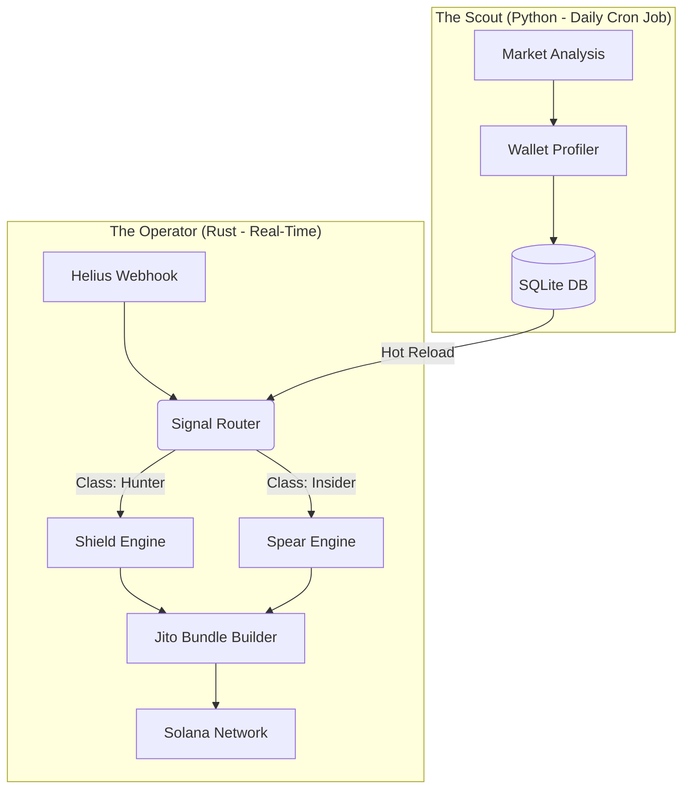

<p align="center">
  
</p>

<h1 align="center">Project Chimera</h1>

<p align="center">
  <strong>An Autonomous, Behavioral Copy-Trading Engine for Solana</strong>
  <br />
  Built in Rust for bulletproof performance and safety.
</p>

<p align="center">
    <a href="#"></a>
    <a href="#"></a>
    <a href="https://github.com/your-username/chimera/actions/workflows/ci.yml"></a>
</p>

---

## 🛡️ The Philosophy: Protect the Downside, Uncap the Upside 🗡️

Standard copy-trading bots are one-dimensional. They either copy every trade and get wrecked by scams, or they are too conservative and miss 100x opportunities.

**Chimera** is different. It operates with a **hybrid brain**, implementing a "Barbell Strategy" that dynamically switches between two personalities:

1.  **The Shield 🛡️ (Capital Preservation):** A risk-averse engine that focuses on high-probability trades from proven "Alpha Hunter" wallets. It grinds small, consistent profits to pay for operational costs and protect the bankroll.

2.  **The Spear 🗡️ (Asymmetric Upside):** A high-aggression engine that activates only on high-conviction signals, such as **Coordinated Insider Clusters** buying a new token. It risks small to hunt for massive, 100x returns.

This allows the bot to survive market downturns using its Shield, while capitalizing on explosive opportunities with its Spear.

## ✨ Key Features

-   **🧠 Behavioral Profiling:** Automatically classifies wallets into profiles like "Insider," "Alpha Hunter," or "Sniper Bot" to understand their intent.
-   **🔗 Cluster Analysis:** Detects coordinated buying from linked groups of wallets—a powerful signal that often precedes a major pump.
-   **🛡️ The Shield Engine:** A conservative execution mode with strict safety checks (LP lock, holder concentration) and fixed profit targets.
-   **🗡️ The Spear Engine:** An aggressive execution mode with dynamic bet sizing (Kelly Criterion) and a "Moonbag" exit strategy to ride tokens to their peak.
-   **🤖 State Management via Telegram:** Full command and control of the bot's operational mode (`Turtle`, `Hunter`, `Freeze`) without touching the server.
-   **💥 Automated Circuit Breakers:** The bot automatically disables failing strategies after a losing streak to prevent "tilt" and protect capital.
-   **⛽ Gasless Execution via Jito:** Uses Jito Bundles to ensure trades are atomic. If a trade fails for any reason (slippage, revert), **you pay zero gas**, eliminating the "death by a thousand cuts" that kills budget bots.
-   **🦀 Built in Rust:** Lightweight, incredibly fast, and memory-safe. Runs efficiently on a cheap ~$8/month VPS.

## 🏛️ Architecture

Chimera is composed of two primary components: a real-time Rust Operator and an offline Python Scout.



## 🛠️ Tech Stack

-   **Core Logic:** **Rust** (with Tokio & Axum) for performance and safety.
-   **Data Analysis:** **Python** (with Pandas) for offline wallet discovery and profiling.
-   **Data Provider:** **Helius** (Developer Plan) for real-time webhooks and transaction history.
-   **Execution:** **Jupiter API** for quotes and **Jito** for atomic, gasless trade execution.
-   **Database:** **SQLite** for lightweight, persistent state management.
-   **Control:** **Telegram** for remote commands and status updates.

## 🚀 Getting Started

### Prerequisites

-   A Linux VPS (e.g., Hetzner CPX11) running Ubuntu 22.04.
-   Rust & Cargo installed.
-   A Helius Developer Plan API Key.
-   A Telegram Bot Token and your User ID.

### 1. Clone the Repository

```bash
git clone https://github.com/your-username/chimera.git
cd chimera
```

### 2. Configuration

1.  Copy the example config: `cp .env.example .env`
2.  Edit the `.env` file and add your Helius API Key, Telegram credentials, and Solana wallet private key.
3.  Run the setup script to initialize the database:
    ```bash
    sh scripts/setup.sh
    ```

### 3. Run The Scout (First Time)

Run the Python script to find your first set of wallets to monitor.

```bash
pip install -r scout/requirements.txt
python scout/main.py
```

### 4. Launch The Operator (Paper Mode)

**Always start in Paper Mode to verify your setup without risking funds.**

```bash
# By default, the bot starts in Paper Mode.
cargo run --release
```

The bot will now listen for trades from your scouted wallets and log what it *would* have done. Once you are confident, edit the `.env` to switch to live trading.
