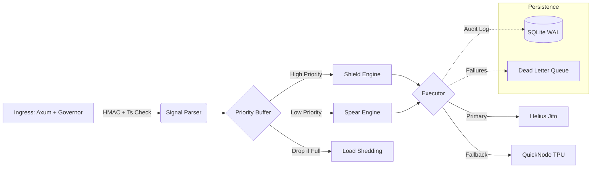
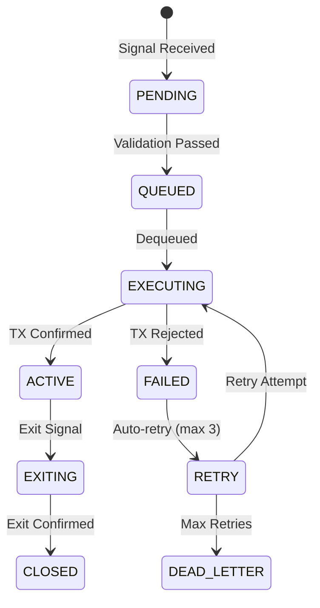

# Product Design Document (PDD): Project Chimera

| Metadata | Details |
| :--- | :--- |
| **Project Name** | Chimera |
| **Version** | **7.1 (Engineering Freeze)** |
| **Date** | December 06, 2025 |
| **Status** | **Approved for Implementation** |
| **Core Stack** | Rust (Tokio/Axum), Python (Pandas), SQLite (WAL) |
| **Observability** | Prometheus, Grafana, Alertmanager |
| **Infrastructure** | Hetzner VPS + Tailscale + Helius (Primary) / QuickNode (Fallback) |

**⚠️ Infrastructure Latency Warning:**
*   Hetzner is usually in Falkenstein/Nuremberg (Germany) or Helsinki. Most Solana validators (and Helius/Jito nodes) have a heavy presence in US-East (Virginia/NY) and Amsterdam.
*   **Action Required:** Ensure your Hetzner VPS is in **Ashburn, VA (US-East)** if possible, or at least Amsterdam. Running high-frequency Solana logic from Helsinki adds ~100ms roundtrip latency compared to Virginia, which defeats the purpose of the "<5ms internal latency" optimization.
*   **Alternative Providers:** If Hetzner Ashburn is unavailable (often sold out of high-performance instances), consider:
    *   **Latitude.sh** (formerly Maxihost): Excellent bare metal in Ashburn/NY with low latency to Helius.
    *   **Cherry Servers:** Strong bare metal options in US-East with competitive pricing.
    *   **Do not compromise on location** - latency to RPC endpoints is critical for execution speed.
*   **Verification:** Before production deployment, measure latency to Helius endpoint: `ping -c 10 <helius-endpoint>` and verify < 50ms.

---

## 1. Executive Summary

**Project Chimera** is a high-frequency, fault-tolerant copy-trading system for Solana. It employs a **Barbell Strategy** (Shield/Spear) to balance capital preservation with asymmetric upside.

**v7.1 Focus:** Moving beyond a "bot" to a **Financial Platform**.
*   **Security:** Replay attack prevention, secret rotation, HMAC verification, and automated secret rotation policies.
*   **Resilience:** Priority queuing (load shedding), fallback RPCs, self-healing databases, circuit breakers, and graceful degradation.
*   **Operations:** Defined SLAs, incident runbooks, structured audit logs, and trade reconciliation.
*   **User Experience:** Professional web dashboard, real-time monitoring, wallet management, and mobile notifications.
*   **API & Compliance:** RESTful API with role-based access, trade reconciliation, and export functionality for audit/tax reporting.

---

## 2. System Architecture

### 2.1 The "Hot Path" (Rust)
The Operator uses **Internal Priority Channels** to manage load without external message brokers (keeping latency < 5ms).



### 2.2 Component Overview

| Component | Tech Stack | Role |
| :--- | :--- | :--- |
| **Ingress** | `axum`, `tower-governor` | DDoS protection, HMAC & Timestamp verification. |
| **The Buffer** | `tokio::mpsc` (Priority) | **Load Shedding:** Drops `Spear` signals first if queue > 800. |
| **The Executor** | Rust + Jito SDK | Manages bundle tips. Falls back to standard TPU if Jito is down. |
| **The Scout** | Python | Updates roster based on WQS (Wallet Quality Score) & Backtesting. |
| **The Vault** | Encrypted File / Env | Stores private keys (AES-256). Never plaintext. |

**⚠️ SQLite Write Lock Mitigation:**
*   **Risk:** While WAL mode allows multiple readers and one writer, you have multiple potential writers: The `Executor` (updating trade states), the `Scout` (updating wallets), and the `Ingress` (logging attempts).
*   **Solution:**
    *   The **Scout (Python)** does not write directly to the active DB file. Instead, Python writes to `roster_new.db` and the Rust Operator performs an **SQL-level merge** (not a file system swap).
    *   **Implementation:** When Rust receives a signal (e.g., SIGHUP or API call), it executes:
        ```sql
        ATTACH DATABASE 'roster_new.db' AS new_roster;
        -- ⚠️ Data Consistency Check: Verify integrity before merge
        PRAGMA new_roster.integrity_check;
        -- If integrity_check returns anything other than 'ok', abort merge and alert admin
        BEGIN TRANSACTION;
        DELETE FROM wallets;  -- Or specific logic to keep history
        INSERT INTO wallets SELECT * FROM new_roster.wallets;
        COMMIT;
        DETACH DATABASE new_roster;
        ```
        *This keeps the Rust connection alive and utilizes WAL concurrency. File system swaps (`mv roster_new.db roster.db`) would crash the Rust app or corrupt the WAL if connections are open.*
    *   **⚠️ Scout Data Consistency Risk:** If Python script crashes halfway through writing `roster_new.db`, the database might be corrupt or incomplete.
    *   **Mitigation:**
        *   Python script must write to a temp file first (e.g., `roster_new.db.tmp`), then strictly rename it to `roster_new.db` only upon successful completion (atomic write).
        *   Rust runs `PRAGMA integrity_check` on `new_roster` after attaching but before merging. If check fails, log error and skip merge (use last-known-good roster).
    *   Set `busy_timeout` in Rust to at least 5000ms to handle momentary locks during checkpoints.

---

## 3. The Scout (Intelligence Layer)

Runs every 24h via Cron. Updates `wallets` table.

### 3.1 Wallet Quality Score (WQS) v2
Refined logic to filter "lucky" traders and "crowded" trades.

```python
def calculate_wqs(wallet):
    score = 0
    # Performance & Consistency
    score += (wallet.roi_30d / 100) * 25
    score += wallet.win_streak_consistency * 20
    
    # NEW: Temporal Consistency (Anti-Pump-and-Dump)
    if wallet.roi_7d > wallet.roi_30d * 2:
        score -= 15  # Penalize recent massive spikes
        
    # NEW: Statistical Significance
    if wallet.trade_count_30d < 20:
        score *= 0.5 # Low confidence penalty
        
    # NEW: Drawdown Penalty
    score -= wallet.max_drawdown_30d * 0.2
    
    return max(0, min(score, 100))
```

### 3.2 Pre-Promotion Backtest
Before a wallet moves from `CANDIDATE` to `ACTIVE`:
1.  Run last 30 days of their trades through the **Simulator**.
2.  **Critical:** The simulator must check **Liquidity** at the time of each historical trade. A wallet might have made 10 SOL on a token that had $100k liquidity then, but if the current liquidity is $5k, that wallet is no longer valid to copy.
3.  If Simulated PnL < 0 (due to slippage/fees), **REJECT**.

---

## 4. The Operator (Execution & Resilience)

### 4.1 Security: Replay & Auth
Middleware applied to every webhook:
1.  **Rate Limit:** Max 100 req/sec via `tower-governor`.
2.  **Signature:** Verify `HMAC_SHA256(timestamp + payload, SECRET)`.
3.  **Replay Check:**
    ```rust
    let req_time = timestamp.parse::<i64>()?;
    if (Utc::now().timestamp() - req_time).abs() > 60 {
        return Err("Request expired");
    }
    ```
4.  **Idempotency (Critical):**
    *   If the signal provider includes a `trade_uuid` in the payload, use it directly.
    *   If no `trade_uuid` provided, generate deterministic hash: `SHA256(timestamp + token + action + amount)`.
    *   Before queueing, check both `dead_letter_queue` and `trades` tables for existing `trade_uuid`.
    *   If duplicate found, return `"status": "rejected", "reason": "duplicate_signal"` without processing.
    *   This prevents double-buys from webhook retries or network blips.

### 4.1.1 Token Safety Checks (TokenParser)
**Risk:** The Scout filters *Wallets*, but does not filter *Tokens*. A "Good Wallet" might buy a token that has a "Freeze Authority" enabled, has a "Mint Authority" (inflation risk), or is a "Honeypot" (cannot sell).

**Implementation:** Add a `TokenParser` component to the Ingress or Executor that validates tokens before execution.

**Rejection Criteria:**
*   **Freeze Authority:** If `freeze_authority != null` → **REJECT** (token can be frozen, making it unsellable).
    *   **Exception:** Known whitelist (e.g., USDC, USDT) are allowed.
*   **Mint Authority:** If `mint_authority != null` → **REJECT** (token supply can be inflated, devaluing holdings).
    *   **Exception:** Known whitelist (e.g., USDC, USDT) are allowed.
*   **Liquidity Check:** If current liquidity < `min_liquidity_threshold` → **REJECT**.
    *   **Thresholds:**
        *   Shield Strategy: `min_liquidity_threshold = $10,000`
        *   Spear Strategy: `min_liquidity_threshold = $5,000` (more aggressive, but still requires minimum liquidity)
*   **Honeypot Detection:** Query token's sell functionality (simulate a 0.001 SOL sell). If transaction would fail → **REJECT**.

**Implementation Location (Fast/Slow Path Pattern):**
*   **⚠️ Latency Risk:** Honeypot detection requires an RPC simulation (50-200ms). Placing this in the Ingress would add RPC round-trips to every signal, causing timeouts or backpressure during high-volume events.
*   **Fast Path (Ingress):** Validate *metadata only* (Freeze/Mint authority) using a cached token map. This is instant (< 1ms).
*   **Slow Path (Executor):** Perform `SimulateTransaction` (Honeypot check) immediately before bundling. This adds latency only to the execution path, not the webhook response.
*   **Optimization:** Maintain a `token_whitelist_cache` (LRU Cache, TTL: 1 hour) of tokens already verified as "safe" to skip simulation for repeated signals on trending tokens (e.g., BONK). Cache key: `token_address + strategy_type`.

**Configuration:**
```rust
token_safety:
  freeze_authority_whitelist: ["EPjFWdd5AufqSSqeM2qN1xzybapC8G4wEGGkZwyTDt1v", ...],  // USDC, etc.
  mint_authority_whitelist: ["EPjFWdd5AufqSSqeM2qN1xzybapC8G4wEGGkZwyTDt1v", ...],
  min_liquidity_shield: 10000,  // USD
  min_liquidity_spear: 5000,    // USD
```

### 4.2 Resilience: Priority Queuing
If `queue_depth > 800` (80% capacity):
1.  **Drop** all new `Spear` (High Risk) signals.
2.  **Process** only `Shield` (Low Risk) and `Exit` (Take Profit) signals.
3.  **Log** dropped signals to `dead_letter_queue` table for analysis.

### 4.3 Fallback RPC Strategy
*   **Primary:** Helius (Jito Bundle enabled).
*   **Secondary:** QuickNode / Triton (Standard TPU).
*   **Trigger:** If Helius fails 3 consecutive requests or latency > 2s.
*   **Behavior:** While on Secondary, **Spear Strategy is DISABLED** (requires Jito). Only Shield and Exits run.

**⚠️ State Management Simplification:**
*   **Risk:** Complex state management if system switches RPC mid-trade. Should trades started in Standard mode revert to Bundles if Helius recovers?
*   **Recommendation:** Keep it simple.
    *   State: `RPC_MODE = JITO | STANDARD` (global, not per-trade).
    *   The Executor checks `RPC_MODE` before every trade.
    *   **Do not hot-swap mid-trade:** If a trade starts in Standard mode, it finishes in Standard mode. RPC mode changes only affect *new* trades dequeued after the switch.
    *   Mode transitions are logged to `config_audit` table.

### 4.3.1 Jito Tip Strategy
**Risk:** Hard-coding a static tip (e.g., 0.001 SOL) is dangerous. Tips that are too low get ignored; tips that are too high erode profits.

**Dynamic Tipping Implementation:**
*   **For Spear Strategy:** Tip `max(jito_tip_floor, 50th_percentile_recent_tips)` to ensure bundle inclusion.
*   **For Shield Strategy:** Use `jito_tip_floor` (lower risk tolerance).
*   **Hard Cap:** Never tip more than `min(jito_tip_ceiling, trade_size * jito_tip_percent_max)` to prevent profit erosion.
*   **Configuration Parameters:**
    ```rust
    jito_tip_floor: 0.001,           // Minimum tip (SOL)
    jito_tip_ceiling: 0.01,          // Maximum tip (SOL)
    jito_tip_percentile: 50,         // Percentile of recent tips to use
    jito_tip_percent_max: 0.10,      // Max tip as % of trade size
    ```
*   **Tip History:** Maintain a rolling window of recent successful Jito bundle tips (last 100 bundles) to calculate percentile dynamically.
*   **Fallback:** If tip history is insufficient (< 10 samples), use `jito_tip_floor`.
*   **⚠️ Cold Start Risk:** Upon fresh restart, memory-resident tip history is empty.
*   **Cold Start Mitigation:**
    *   Persist `jito_tip_history` to SQLite table `jito_tip_history` (or JSON file) on graceful shutdown.
    *   On startup, load persisted history. If empty or insufficient (< 10 samples), use `tip_floor * 2` for the first 10 trades to ensure bundle inclusion while history buffer rebuilds.
    *   After 10 successful bundles, switch to percentile-based calculation.

### 4.4 Circuit Breaker Thresholds
Automatic trading halts to prevent catastrophic losses:

```rust
// Configuration structure
circuit_breakers:
  max_loss_24h: 500        # USD - halt all trading
  max_consecutive_losses: 5 # Pause Spear strategy
  max_drawdown_percent: 15  # Emergency exit all positions
  cool_down_period_minutes: 30  # After circuit trips
```

**Behavior:**
*   When any threshold is breached, trading is **immediately halted**.
*   Active positions are evaluated: if in profit, they remain open; if at loss, exit signals are queued.
*   Circuit breaker state is logged to `config_audit` table with `changed_by: 'SYSTEM_CIRCUIT_BREAKER'`.
*   Manual override requires admin authentication via `/api/v1/config/circuit-breaker/reset`.

**Price Cache for Unrealized PnL:**
*   **Risk:** If `max_drawdown_percent` is based on *unrealized* PnL, fetching prices for all open positions can be slow and rate-limit intensive.
*   **Solution:** Maintain a local **Price Cache** for active tokens, updated via a lightweight WebSocket stream (e.g., Pyth or simplified Helius stream), separate from trade execution RPC usage.
*   Cache refresh interval: 5 seconds for active positions.
*   Fallback: If cache miss, query RPC once per position (not per check).

### 4.5 Position State Machine
Formal state transitions prevent orphaned positions and ensure auditability:



**State Definitions:**
*   **PENDING:** Signal received, awaiting validation (HMAC, timestamp, balance check).
*   **QUEUED:** Validated, in priority buffer awaiting execution.
*   **EXECUTING:** Transaction submitted to RPC, awaiting confirmation.
*   **ACTIVE:** On-chain position confirmed, actively tracked.
*   **EXITING:** Exit signal received, selling transaction in flight.
*   **CLOSED:** Position fully exited, PnL calculated.
*   **FAILED:** Transaction rejected (insufficient funds, slippage, etc.).
*   **RETRY:** Failed transaction queued for retry (exponential backoff).
*   **DEAD_LETTER:** Max retries exhausted, requires manual intervention.

### 4.6 Graceful Degradation Matrix
Explicit failure response protocols:

| Failure | Impact | Automatic Response | Manual Override |
|---------|--------|-------------------|-----------------|
| **Helius Down** | No Jito bundles | Switch to QuickNode + disable Spear | Force re-enable via config |
| **SQLite Locked** | Writes fail | Retry 3x with backoff → restart service | Check for VACUUM running |
| **Scout Fails** | Stale roster | Use last-known-good roster for 48h | Manual wallet.json upload |
| **Memory > 90%** | OOM risk | Aggressive load shedding → restart | Increase VPS RAM |
| **Disk Full** | Logs/DB fail | Prune logs > 7 days, alert admin | Manual cleanup required |
| **RPC Rate Limit** | All trades fail | Exponential backoff, switch RPC | Rotate API keys |

### 4.7 "Stuck State" Recovery
**Problem:** If a position remains in `EXITING` for > 60 seconds (signature generated but not confirmed), the transaction may have failed due to blockhash expiration or network issues.

**Automatic Recovery:**
1. Query the blockhash validity via RPC.
2. If blockhash expired or transaction not found on-chain:
   *   Revert state from `EXITING` → `ACTIVE` automatically.
   *   Log recovery action to `config_audit` table.
   *   Allow new exit signal to be processed.
3. If transaction is confirmed on-chain but DB state is stale:
   *   Update state to `CLOSED` and calculate final PnL.
   *   Log reconciliation event to `reconciliation_log`.

### 4.8 Secret Rotation Schedule
Automated rotation policies for security compliance:

| Secret Type | Rotation Frequency | Trigger | Storage |
|-------------|-------------------|---------|---------|
| **Webhook HMAC Key** | Every 30 days | Cron + coordinated update | Encrypted config file |
| **Wallet Private Key** | On compromise only | Manual + Cold storage backup | AES-256 encrypted vault |
| **RPC API Keys** | Every 90 days | Cron + Hot-swap (zero downtime) | Environment variables |
| **Database Encryption Key** | Annually | Manual migration with downtime window | Hardware Security Module (HSM) preferred |

**Rotation Process:**
1. Generate new secret (cryptographically secure).
2. Update encrypted config with new value.
3. Grace period: Accept both old and new secrets for 24h.
4. After grace period, reject requests with old secret.
5. Log rotation event to `config_audit` table.

---

## 5. API Contract Documentation

### 5.1 Public Endpoints

All endpoints require authentication via HMAC signature (webhook endpoints) or API key (management endpoints).

#### Webhook Endpoint
```
POST /api/v1/webhook
Content-Type: application/json
X-Signature: HMAC_SHA256(timestamp + payload, SECRET)
X-Timestamp: <unix_timestamp>

Request Body:
{
  "strategy": "SHIELD" | "SPEAR" | "EXIT",
  "token": "BONK",
  "action": "BUY" | "SELL",
  "amount_sol": 0.5,
  "wallet_address": "7xKXtg2CW87d97TXJSDpbD5jBkheTqA83TZRuJosgAsU",
  "trade_uuid": "optional-uuid-from-signal-provider"  # If omitted, system generates deterministic hash
}

Response:
{
  "status": "accepted" | "rejected",
  "trade_uuid": "uuid-1234",
  "reason": "optional rejection reason"
}
```

#### Management Endpoints

**Get Active Positions**
```
GET /api/v1/positions
Authorization: Bearer <api_key>

Response:
{
  "positions": [
    {
      "trade_uuid": "uuid-1234",
      "token": "BONK",
      "strategy": "SHIELD",
      "size_sol": 0.5,
      "entry_price": 0.000012,
      "current_price": 0.000015,
      "pnl_percent": 25.0,
      "state": "ACTIVE",
      "opened_at": "2025-12-06T10:00:00Z"
    }
  ]
}
```

**List Tracked Wallets**
```
GET /api/v1/wallets?status=ACTIVE|CANDIDATE
Authorization: Bearer <api_key>

Response:
{
  "wallets": [
    {
      "address": "7xKXtg2CW87d97TXJSDpbD5jBkheTqA83TZRuJosgAsU",
      "wqs_score": 85.3,
      "status": "ACTIVE",
      "roi_30d": 45.2,
      "trade_count_30d": 127,
      "last_updated": "2025-12-06T09:00:00Z"
    }
  ]
}
```

**Promote/Demote Wallet**
```
PUT /api/v1/wallets/{address}
Authorization: Bearer <api_key>

Request Body:
{
  "status": "ACTIVE" | "CANDIDATE" | "REJECTED",
  "reason": "optional reason for status change",
  "ttl_hours": 24  # Optional: Time To Live. Auto-demote to CANDIDATE after specified hours.
}
```

**TTL Feature:**
*   Allows temporary promotion of a wallet to `ACTIVE` for a specific duration (e.g., 24 hours).
*   Useful for riding a specific trader's hot streak without permanent commitment.
*   After TTL expires, wallet automatically reverts to `CANDIDATE` status.
*   If `ttl_hours` is omitted, promotion is permanent until manually changed.

**Get Configuration**
```
GET /api/v1/config
Authorization: Bearer <admin_api_key>

Response:
{
  "circuit_breakers": {
    "max_loss_24h": 500,
    "max_consecutive_losses": 5,
    "max_drawdown_percent": 15
  },
  "strategy_allocation": {
    "shield_percent": 70,
    "spear_percent": 30
  },
  "jito_tip_strategy": {
    "tip_floor": 0.001,
    "tip_ceiling": 0.01,
    "tip_percentile": 50,
    "tip_percent_max": 0.10
  },
  "rpc_status": {
    "primary": "helius",
    "active": "helius",
    "fallback_triggered": false
  }
}
```

**Update Configuration**
```
PUT /api/v1/config
Authorization: Bearer <admin_api_key>

Request Body:
{
  "circuit_breakers": {
    "max_loss_24h": 750  // Only include fields to update
  }
}
```

**Health Check**
```
GET /api/v1/health

Response:
{
  "status": "healthy" | "degraded" | "unhealthy",
  "uptime_seconds": 432000,
  "queue_depth": 12,
  "rpc_latency_ms": 145,
  "last_trade_at": "2025-12-06T10:00:00Z"
}
```

### 5.2 Authentication

**Webhook Authentication:**
*   HMAC-SHA256 signature of `timestamp + request_body` using shared secret.
*   Timestamp must be within ±60 seconds of server time.
*   Signature provided in `X-Signature` header.

**Management API Authentication:**
*   Bearer token in `Authorization` header.
*   Tokens scoped by role: `readonly`, `operator`, `admin`.
*   Admin tokens required for configuration changes and circuit breaker resets.

---

## 6. Database Schema (v7.1)

Designed for Audit Compliance and Disaster Recovery.

```sql
-- 1. Configuration Versioning (Audit Trail)
CREATE TABLE config_audit (
    id INTEGER PRIMARY KEY,
    key TEXT NOT NULL,
    old_value TEXT,
    new_value TEXT,
    changed_by TEXT, -- 'ADMIN', 'SYSTEM_CIRCUIT_BREAKER'
    changed_at TIMESTAMP DEFAULT CURRENT_TIMESTAMP
);

-- 2. Backups Tracking
CREATE TABLE backups (
    id INTEGER PRIMARY KEY,
    path TEXT,
    size_bytes INTEGER,
    checksum TEXT,
    created_at TIMESTAMP DEFAULT CURRENT_TIMESTAMP
);

-- 3. Dead Letter Queue (Failed Operations)
CREATE TABLE dead_letter_queue (
    id INTEGER PRIMARY KEY,
    payload TEXT,
    reason TEXT, -- 'QUEUE_FULL', 'PARSE_ERROR'
    received_at TIMESTAMP DEFAULT CURRENT_TIMESTAMP
);

-- 4. Trade Reconciliation (Financial Platform Requirement)
CREATE TABLE reconciliation_log (
    id INTEGER PRIMARY KEY,
    trade_uuid TEXT NOT NULL,
    expected_state TEXT NOT NULL, -- 'ACTIVE', 'CLOSED', etc.
    actual_on_chain TEXT, -- 'FOUND', 'MISSING', 'AMOUNT_MISMATCH'
    discrepancy TEXT, -- 'NONE', 'MISSING_TX', 'AMOUNT_MISMATCH', 'STATE_MISMATCH'
    on_chain_tx_signature TEXT,
    on_chain_amount_sol REAL,
    expected_amount_sol REAL,
    resolved_at TIMESTAMP,
    resolved_by TEXT, -- 'AUTO', 'ADMIN', 'SYSTEM'
    notes TEXT,
    created_at TIMESTAMP DEFAULT CURRENT_TIMESTAMP
);

-- 6. Admin Wallets (Authorization)
CREATE TABLE admin_wallets (
    wallet_address TEXT PRIMARY KEY,
    role TEXT NOT NULL DEFAULT 'admin', -- 'admin', 'operator', 'readonly'
    added_at TIMESTAMP DEFAULT CURRENT_TIMESTAMP,
    added_by TEXT -- 'SYSTEM', 'ADMIN', etc.
);

-- 7. Jito Tip History (Cold Start Persistence)
CREATE TABLE jito_tip_history (
    id INTEGER PRIMARY KEY,
    tip_amount_sol REAL NOT NULL,
    bundle_signature TEXT,
    strategy TEXT, -- 'SHIELD' | 'SPEAR'
    created_at TIMESTAMP DEFAULT CURRENT_TIMESTAMP
);
CREATE INDEX idx_jito_tip_history_created ON jito_tip_history(created_at DESC);
-- Maintain rolling window: DELETE FROM jito_tip_history WHERE created_at < datetime('now', '-7 days');

-- 8. Active Indexes
CREATE INDEX idx_trades_status ON trades(status) WHERE status = 'QUEUED';
CREATE INDEX idx_trades_uuid ON trades(trade_uuid); -- UNIQUE constraint for idempotency
CREATE INDEX idx_positions_state ON positions(state, last_updated);
CREATE INDEX idx_reconciliation_unresolved ON reconciliation_log(resolved_at) WHERE resolved_at IS NULL;
```

**Maintenance Cron:**
```bash
# Daily VACUUM
0 3 * * * sqlite3 chimera.db "VACUUM INTO '/backups/chimera-$(date +\%F).db'"

# Daily Reconciliation (runs at 4 AM)
0 4 * * * /usr/local/bin/chimera-reconcile
```

**Reconciliation Process:**
1. Query all positions in `ACTIVE` or `EXITING` state.
2. For each position, query on-chain state via RPC (check transaction signatures, token balances).
3. Compare expected state vs. actual on-chain state.
4. If discrepancy found, insert into `reconciliation_log` with `resolved_at = NULL`.
5. Auto-resolution attempts:
   *   If transaction found on-chain but DB shows `FAILED` → update DB to `ACTIVE`.
   *   If transaction missing but DB shows `ACTIVE` → mark as `DISCREPANCY` (requires manual review).
6. Admin dashboard shows unresolved discrepancies for manual intervention.

**Dust Tolerance (Epsilon):**
*   **Edge Case:** If the DB says we hold 100.0 BONK, but on-chain says 99.99998 (due to transfer tax or rounding), the reconciliation log will flag this constantly.
*   **Fix:** Implement an `epsilon` (tolerance threshold) for the `AMOUNT_MISMATCH` check. Default: `< 0.01%` difference is ignored.
*   **Refined SQL for Reconciliation (handles epsilon in query):**
    ```sql
    -- Instead of doing math in code, handle the epsilon in the query
    SELECT 
        t.trade_uuid, 
        t.expected_amount, 
        o.on_chain_amount,
        ABS(t.expected_amount - o.on_chain_amount) as diff
    FROM trades t
    JOIN on_chain_snapshot o ON t.token_address = o.token_address
    WHERE 
        t.status = 'ACTIVE' 
        AND diff > 0.000001; -- Ignore dust differences below this threshold
    ```
*   **Alternative (percentage-based):** If `abs(expected_amount - actual_amount) / expected_amount < 0.0001`, treat as match.

---

## 7. Observability & Monitoring

### 6.1 Structured Logging
All logs must output JSON with correlation IDs.
```json
{
  "timestamp": "2025-12-06T10:00:00Z",
  "level": "INFO",
  "trace_id": "uuid-1234",
  "trade_uuid": "trade-5678",
  "component": "Engine::Shield",
  "message": "Order Submitted",
  "latency_ms": 145
}
```

### 6.2 Critical Alerts (Alertmanager)

| Alert Name | Condition | Severity | Action |
| :--- | :--- | :--- | :--- |
| **QueueBackpressure** | `queue_depth > 800` | **WARNING** | Investigate consumer lag. |
| **TradeLatency** | `p99(trade_ms) > 2000` | **CRITICAL** | Check RPC health. |
| **WebhookRejections** | `rate(hmac_fail[5m]) > 10` | **CRITICAL** | Potential Attack. IP Ban. |
| **DiskSpace** | `disk_free < 10%` | **WARNING** | Prune logs/backups. |
| **MemoryPressure** | `memory_rss > 85%` | **CRITICAL** | Restart impending. |

### 6.3 Dashboard (Grafana)

```
┌────────────────────────────────────────────────────────────────────────────┐
│  ⬤ SYSTEM HEALTHY │ ◎ 12.45 SOL │ NAV: $1,234.56 │ 🔄 Last: 2s ago        │
├────────────────────────────────────────────────────────────────────────────┤
│                                                                            │
│  ┌─ PERFORMANCE ────────────────────────────────────────────────────────┐  │
│  │  📈 24H: +$127.50 (+10.3%)   │   7D: +$892.30   │   30D: +$2,340.00  │  │
│  └──────────────────────────────────────────────────────────────────────┘  │
│                                                                            │
│  ┌─ STRATEGY BREAKDOWN ─────────────────────────────────────────────────┐  │
│  │  🛡️ SHIELD                      │  ⚔️ SPEAR                          │  │
│  │  Win: 72% │ Avg: +8% │ Pos: 2   │  Win: 61% │ Avg: +23% │ Pos: 2    │  │
│  │  ▓▓▓▓▓▓▓░░░ Allocated: 70%      │  ▓▓▓░░░░░░░ Allocated: 30%        │  │
│  └──────────────────────────────────────────────────────────────────────┘  │
│                                                                            │
│  ┌─ SYSTEM HEALTH ──────────────────────────────────────────────────────┐  │
│  │  Queue: 12/1000 ▓░░░░░░░░░   │  Helius: 🟢   │  Jito: 🟢   │ RPC: 🟢 │  │
│  │  CPU: 12% │ Mem: 340MB │ Disk: 2.1GB free │ Uptime: 4d 12h 33m     │  │
│  └──────────────────────────────────────────────────────────────────────┘  │
│                                                                            │
│  ═══════════════════════ LIVE POSITIONS ════════════════════════════════   │
│  │ Token │ Strat │ Size   │ Entry    │ Current  │ PnL    │ Status    │   │
│  │ $BONK │ 🛡️    │ 0.5 SOL│ 0.000012 │ 0.000015 │ +25.0% │ 🟢 ACTIVE │   │
│  │ $WIF  │ ⚔️    │ 0.3 SOL│ 1.23     │ 1.45     │ +17.9% │ 🟡 EXITING│   │
└────────────────────────────────────────────────────────────────────────────┘
```

---

## 8. User Interface Design

### 7.1 Design Philosophy
Moving from a "bot" to a **Financial Platform** requires a professional, trader-focused interface that provides real-time visibility and control.

### 7.2 Visual Language

**Theme:**
*   **Primary:** Dark mode (traders prefer low-light environments).
*   **Accent Colors:**
    *   Shield positions → Cool blues/cyans (`#00D4FF`, `#0099CC`)
    *   Spear positions → Warm oranges/ambers (`#FF8800`, `#FF6600`)
    *   Profit → Electric green (`#00FF88`)
    *   Loss → Soft red (`#FF4444`)
    *   Neutral/System → Gray scale (`#1A1A1A` background, `#E0E0E0` text)

**Typography:**
*   **Numbers/Monospace:** JetBrains Mono (for precision in financial data)
*   **Labels/UI:** Satoshi or Inter (modern, readable sans-serif)
*   **Headings:** Bold, uppercase for section headers

**Layout Principles:**
*   **Information Density:** High (traders need data, not whitespace)
*   **Real-time Updates:** WebSocket connections for live data
*   **Mobile Responsive:** Critical alerts accessible on mobile, full dashboard on desktop

### 7.3 Key Screens

#### 7.3.1 Command Center (Dashboard)
**Primary view for operators. Real-time system health and performance.**

**Layout:**
```
┌────────────────────────────────────────────────────────────────────────────┐
│  CHIMERA │ ⬤ SYSTEM HEALTHY │ ◎ 12.45 SOL │ NAV: $1,234.56 │ 🔄 2s ago    │
├────────────────────────────────────────────────────────────────────────────┤
│                                                                            │
│  ┌─ PERFORMANCE METRICS ─────────────────────────────────────────────────┐  │
│  │  📈 24H: +$127.50 (+10.3%)   │   7D: +$892.30   │   30D: +$2,340.00  │  │
│  │  [Line Chart: 30-day PnL trend]                                        │  │
│  └──────────────────────────────────────────────────────────────────────┘  │
│                                                                            │
│  ┌─ STRATEGY BREAKDOWN ─────────────────────────────────────────────────┐  │
│  │  🛡️ SHIELD                      │  ⚔️ SPEAR                          │  │
│  │  Win: 72% │ Avg: +8% │ Pos: 2   │  Win: 61% │ Avg: +23% │ Pos: 2    │  │
│  │  ▓▓▓▓▓▓▓░░░ Allocated: 70%      │  ▓▓▓░░░░░░░ Allocated: 30%        │  │
│  └──────────────────────────────────────────────────────────────────────┘  │
│                                                                            │
│  ┌─ SYSTEM HEALTH ──────────────────────────────────────────────────────┐  │
│  │  Queue: 12/1000 ▓░░░░░░░░░   │  Helius: 🟢   │  Jito: 🟢   │ RPC: 🟢 │  │
│  │  CPU: 12% │ Mem: 340MB │ Disk: 2.1GB free │ Uptime: 4d 12h 33m     │  │
│  └──────────────────────────────────────────────────────────────────────┘  │
│                                                                            │
│  ═══════════════════════ LIVE POSITIONS ════════════════════════════════   │
│  │ Token │ Strat │ Size   │ Entry    │ Current  │ PnL    │ Status    │   │
│  │ $BONK │ 🛡️    │ 0.5 SOL│ 0.000012 │ 0.000015 │ +25.0% │ 🟢 ACTIVE │   │
│  │ $WIF  │ ⚔️    │ 0.3 SOL│ 1.23     │ 1.45     │ +17.9% │ 🟡 EXITING│   │
│  │ [Click row to expand: on-chain TX link, entry/exit timestamps]         │  │
└────────────────────────────────────────────────────────────────────────────┘
```

**Features:**
*   Auto-refresh every 2 seconds (WebSocket push).
*   Clickable positions → expand to show transaction signatures, on-chain links.
*   Color-coded PnL (green/red) with percentage and absolute SOL/USD.
*   System health indicators with drill-down to detailed metrics.

#### 7.3.2 Wallet Roster Management
**Track, promote, and demote wallets based on WQS scores.**

**Layout:**
```
┌────────────────────────────────────────────────────────────────────────────┐
│  WALLET ROSTER                                                             │
├────────────────────────────────────────────────────────────────────────────┤
│  [Filter: All | ACTIVE | CANDIDATE | REJECTED]  [Search: wallet address]  │
│                                                                            │
│  ┌──────────────────────────────────────────────────────────────────────┐  │
│  │ Address                    │ WQS  │ ROI 30d │ Trades │ Status │ Action│  │
│  ├──────────────────────────────────────────────────────────────────────┤  │
│  │ 7xKXtg...gAsU             │ 85.3 │ +45.2%  │ 127    │ ACTIVE │ [Demote]│  │
│  │  [Expand: Backtest results, recent trades, drawdown chart]            │  │
│  ├──────────────────────────────────────────────────────────────────────┤  │
│  │ 9mNpQr...hBvX             │ 72.1 │ +32.8%  │ 89     │ CANDIDATE│[Promote]│  │
│  └──────────────────────────────────────────────────────────────────────┘  │
│                                                                            │
│  [Bulk Actions: Promote Selected | Demote Selected | Export CSV]          │
└────────────────────────────────────────────────────────────────────────────┘
```

**Features:**
*   Sortable columns (WQS, ROI, trade count).
*   Expandable rows showing backtest results, trade history, drawdown visualization.
*   One-click promote/demote with confirmation dialog.
*   Export to CSV for external analysis.

#### 7.3.3 Trade Ledger
**Complete audit trail with on-chain verification.**

**Layout:**
```
┌────────────────────────────────────────────────────────────────────────────┐
│  TRADE LEDGER                                                               │
├────────────────────────────────────────────────────────────────────────────┤
│  [Date Range Picker] [Filter: Strategy | Status | Token] [Export CSV/PDF] │
│                                                                            │
│  ┌──────────────────────────────────────────────────────────────────────┐  │
│  │ Time      │ Token │ Strategy │ Action │ Amount │ Price │ Status │ Link │  │
│  ├──────────────────────────────────────────────────────────────────────┤  │
│  │ 10:00:00  │ BONK  │ 🛡️ SHIELD│ BUY    │ 0.5 SOL│ 0.000012│ ✅ ACTIVE│[🔗]│  │
│  │ 09:45:23  │ WIF   │ ⚔️ SPEAR │ SELL   │ 0.3 SOL│ 1.45   │ ✅ CLOSED│[🔗]│  │
│  │ 09:30:15  │ PEPE  │ 🛡️ SHIELD│ BUY    │ 0.2 SOL│ 0.000008│ ❌ FAILED│[🔗]│  │
│  └──────────────────────────────────────────────────────────────────────┘  │
│                                                                            │
│  [Pagination: 1 2 3 ... 10]  [Per Page: 25 | 50 | 100]                    │
└────────────────────────────────────────────────────────────────────────────┘
```

**Features:**
*   Click transaction link → opens Solscan/Solana Explorer in new tab.
*   Status badges: ✅ Success, ❌ Failed, 🟡 Pending, 🔄 Retrying.
*   Export functionality: CSV for Excel, PDF for tax reporting.
*   Reconciliation status indicator (if discrepancy found, highlight row).

#### 7.3.4 Configuration & Risk Management
**Runtime configuration, circuit breakers, and emergency controls.**

**Layout:**
```
┌────────────────────────────────────────────────────────────────────────────┐
│  CONFIGURATION                                                              │
├────────────────────────────────────────────────────────────────────────────┤
│  [Tabs: Circuit Breakers | Strategy Allocation | RPC Settings | Secrets]  │
│                                                                            │
│  ┌─ CIRCUIT BREAKERS ────────────────────────────────────────────────────┐  │
│  │  Max Loss (24h):     [500] USD    [Save]                              │  │
│  │  Max Consecutive Losses: [5]      [Save]                              │  │
│  │  Max Drawdown:       [15] %       [Save]                              │  │
│  │  Cooldown Period:    [30] minutes [Save]                              │  │
│  │                                                                            │
│  │  Status: 🟢 ACTIVE (No breaches)                                        │  │
│  │  [Emergency: Halt All Trading] [Reset Circuit Breaker]                 │  │
│  └──────────────────────────────────────────────────────────────────────┘  │
│                                                                            │
│  ┌─ STRATEGY ALLOCATION ─────────────────────────────────────────────────┐  │
│  │  Shield: [70] %  Spear: [30] %  [Save]                                │  │
│  │  [Visual slider/input with real-time validation]                       │  │
│  └──────────────────────────────────────────────────────────────────────┘  │
└────────────────────────────────────────────────────────────────────────────┘
```

**Features:**
*   Real-time validation (e.g., allocation must sum to 100%).
*   Change history (link to `config_audit` table entries).
*   Emergency kill switch (requires 2FA confirmation).
*   Secret rotation status (last rotated date, next rotation due).

#### 7.3.5 Incident Log
**Dead letters, alerts, and resolved issues.**

**Layout:**
```
┌────────────────────────────────────────────────────────────────────────────┐
│  INCIDENT LOG                                                               │
├────────────────────────────────────────────────────────────────────────────┤
│  [Filter: Unresolved | All] [Severity: Critical | Warning | Info]          │
│                                                                            │
│  ┌──────────────────────────────────────────────────────────────────────┐  │
│  │ Time      │ Severity │ Component │ Message              │ Status    │  │
│  ├──────────────────────────────────────────────────────────────────────┤  │
│  │ 10:15:00  │ ⚠️ WARN  │ Queue     │ Backpressure: 850/1000│ Resolved  │  │
│  │ 10:10:00  │ 🔴 CRIT  │ RPC       │ Helius timeout       │ Investigating││
│  │ 10:05:00  │ ℹ️ INFO  │ Scout    │ Wallet promoted: ABC  │ Resolved  │  │
│  └──────────────────────────────────────────────────────────────────────┘  │
│                                                                            │
│  [Export Logs] [Mark as Resolved]                                          │
└────────────────────────────────────────────────────────────────────────────┘
```

**Features:**
*   Real-time alert feed (WebSocket push for critical alerts).
*   Filter by severity, component, time range.
*   Mark incidents as resolved with notes.
*   Export logs for external analysis.

### 7.4 Authentication & Authorization

**Authentication Methods:**
1. **API Key** (for programmatic access)
2. **Solana Wallet Connect** (for web UI - native to crypto ecosystem)
3. **OAuth 2.0** (Google/GitHub - optional for team access)

**Authorization Roles:**
*   **Readonly:** View dashboard, positions, trades (no modifications)
*   **Operator:** Promote/demote wallets, view config (no circuit breaker changes)
*   **Admin:** Full access including configuration, circuit breaker resets, secret rotation

**Admin Wallet Configuration:**
*   Maintain a table `admin_wallets` in the config database.
*   **Logic:** `if wallet_address in config.admin_wallets -> Role: Admin`. Otherwise, deny access or default to `Readonly` (if public access is enabled).
*   Admin wallets are set via environment variable or encrypted config file at startup.

### 7.5 Mobile & Notifications

**Push Notifications (via Telegram/Discord Bot or native mobile app):**
*   **Critical:** Circuit breaker triggered, wallet drained alert, system crash
*   **Important:** Position exited (profit/loss), new wallet promoted, RPC fallback triggered
*   **Info:** Daily performance summary, weekly report

**Mobile Web View:**
*   Simplified dashboard (key metrics only)
*   Quick actions: Emergency halt, view active positions
*   Responsive design (works on iOS/Android browsers)

---

## 9. Operations & Runbooks

### 7.1 SLA Definitions
*   **Uptime:** 99.5% (Max 3.6 hours downtime/month).
*   **Latency:** 95% of trades submitted < 500ms from webhook receipt.
*   **RPO (Data Loss):** Max 6 hours (Backup frequency).

### 7.2 Incident Runbook: `WalletDrained`
**Trigger:** `delta(sol_balance[1h]) < -5 SOL`
1.  **Kill Switch:** SSH in, run `systemctl stop chimera`.
2.  **Verify:** Check on-chain balance via Solscan (rule out false positive).
3.  **Contain:** If real, transfer remaining funds to Cold Wallet immediately.
4.  **Audit:** Run `sqlite3 chimera.db "SELECT * FROM trades ORDER BY id DESC LIMIT 20"` to find the rogue trade.
5.  **Rotate:** Generate new Keypair. Update `config.enc`.

### 7.3 Incident Runbook: `SystemCrash`
**Trigger:** `up{job="operator"} == 0`
1.  **Check Logs:** `journalctl -u chimera -n 50 --no-pager`.
2.  **Restart:** `systemctl restart chimera`.
3.  **Verify State:** Check `positions` table. If trades are stuck in `EXECUTING`, manually verify on-chain and update DB state.

### 7.4 Final Verification Steps (Pre-Deployment)

**⚠️ Critical:** Before the "Engineering Freeze" is lifted for deployment, verify these three configurations. Failure to verify can cause production incidents.

1.  **Verify Time Sync:**
    *   **Command:** `timedatectl status` or `ntpq -p`
    *   **Requirement:** System time must be synced via NTP (Network Time Protocol).
    *   **Why:** The HMAC replay protection (`abs(now - req_time) > 60`) will reject valid signals if the server clock drifts. A 5-minute drift = all webhooks rejected.
    *   **Action:** If not synced, run `sudo timedatectl set-ntp true` and verify sync status.

2.  **Verify Latency:**
    *   **Command:** `ping -c 10 <helius-jito-endpoint>` (replace with actual Helius Jito endpoint URL/IP)
    *   **Requirement:** Average latency must be < 50ms.
    *   **Why:** Latency > 50ms defeats the purpose of the "<5ms internal latency" optimization and increases risk of blockhash expiration.
    *   **Action:** If latency > 50ms, **do not deploy Spear strategy**. Consider relocating VPS or using alternative provider (Latitude.sh, Cherry Servers).

3.  **Circuit Breaker Test:**
    *   **Test:** Manually insert a "fake" loss into the `trades` table that exceeds the `$500` limit (or configured `max_loss_24h`).
    *   **Command:** 
        ```sql
        INSERT INTO trades (trade_uuid, status, pnl_usd, created_at) 
        VALUES ('test-circuit-breaker', 'CLOSED', -600.00, datetime('now'));
        ```
    *   **Verification:** Send a test webhook to `/api/v1/webhook` and verify the system automatically rejects it with status `"rejected"` and reason `"circuit_breaker_triggered"`.
    *   **Cleanup:** Delete test trade after verification.
    *   **Why:** Ensures automatic trading halts work correctly before real money is at risk.

**Deployment Gate:** All three verifications must pass before deploying to production with real funds.

---

## 10. Implementation Checklist

### Phase 1: Security & Foundation
- [x] Implement Axum middleware (HMAC + Timestamp + RateLimit). - Implemented in `operator/src/middleware/`
- [x] Implement TokenParser (Token Safety Checks: freeze authority, mint authority, liquidity validation, honeypot detection). - Implemented in `operator/src/token/parser.rs`
- [x] Implement TokenParser fast/slow path (metadata check in Ingress, honeypot simulation in Executor). - Fast path in webhook handler, slow path in executor
- [x] Implement token whitelist cache (LRU, TTL: 1 hour) to skip honeypot checks for verified tokens. - Implemented in `operator/src/token/cache.rs`
- [x] Set up Encrypted Config Loader (AES-256). - Implemented in `operator/src/vault.rs`
- [x] Implement SQLite WAL + Backup Cron. - WAL configured in `database/schema.sql`, backup in `ops/backup.sh`
- [x] Implement secret rotation automation (cron + grace period logic). - Script in `ops/rotate-secrets.sh`

### Phase 2: Core Logic & Resilience
- [x] Implement `PriorityChannel` (Shield > Spear). - Implemented in `operator/src/engine/channel.rs`
- [x] Implement RPC Fallback Logic (Switch to QuickNode on error) with simplified state management (RPC_MODE global, no hot-swap mid-trade). - Implemented in `operator/src/engine/executor.rs`
- [x] Implement Dynamic Jito Tip Strategy (percentile-based, with floor/ceiling caps). - Implemented in `operator/src/engine/tips.rs`
- [x] Implement Jito tip history persistence (SQLite table `jito_tip_history`) with cold start handling (tip_floor * 2 for first 10 trades). - Table exists, persistence in `operator/src/db.rs`, cold start in `operator/src/engine/tips.rs`
- [x] Build Dead Letter Queue handler. - Implemented in `operator/src/engine/degradation.rs`
- [x] Implement Position State Machine (all state transitions with validation). - Implemented in `operator/src/models/trade.rs`
- [x] Implement Circuit Breaker logic (automatic halts on threshold breach). - Implemented in `operator/src/circuit_breaker.rs`
- [x] Implement Graceful Degradation handlers (SQLite retry, memory pressure, etc.). - Implemented in `operator/src/engine/degradation.rs`
- [x] Implement "Stuck State" recovery logic (EXITING > 60s → check blockhash → revert to ACTIVE if expired). - Implemented in `operator/src/engine/recovery.rs`
- [x] Implement Price Cache for unrealized PnL calculations (WebSocket stream, 5s refresh). - Implemented in `operator/src/price_cache.rs` with Jupiter API integration
- [x] Implement SQLite write lock mitigation (Scout writes to `roster_new.db`, SQL-level merge using ATTACH DATABASE in Rust). - Implemented in `operator/src/roster.rs` and `scout/core/db_writer.py`
- [x] Implement Scout data consistency checks (atomic write via temp file + rename, PRAGMA integrity_check before merge). - Atomic writes in `scout/core/db_writer.py`, integrity check in `operator/src/roster.rs`
- [x] Set SQLite `busy_timeout` to 5000ms in Rust connection pool. - Set in `operator/src/db.rs` line 38

### Phase 3: Intelligence
- [x] Update Scout with WQS v2 (Drawdown/Spike logic). - Implemented in `scout/core/wqs.py`
- [x] Implement Backtesting Simulator with **Liquidity Checks** (verify historical liquidity at time of trade). - Implemented in `scout/core/backtester.py`
- [x] Implement Pre-Promotion Backtest (reject wallets with negative simulated PnL or insufficient historical liquidity). - Integrated in `scout/core/validator.py` and `scout/main.py`

### Phase 4: API & Data Layer
- [x] Implement REST API endpoints (`/api/v1/positions`, `/api/v1/wallets`, etc.). - Implemented in `operator/src/handlers/api.rs`
- [x] Implement API authentication (Bearer tokens with role-based access). - Implemented in `operator/src/middleware/auth.rs`
- [x] Implement webhook idempotency (trade_uuid deduplication, check `dead_letter_queue` and `trades` tables). - Implemented in `operator/src/handlers/webhook.rs`
- [x] Add `reconciliation_log` table to database schema. - Exists in `database/schema.sql`
- [x] Add `admin_wallets` table to database schema. - Exists in `database/schema.sql`
- [x] Add `jito_tip_history` table to database schema (for cold start persistence). - Exists in `database/schema.sql`
- [x] Implement daily reconciliation cron job (compare DB vs on-chain state with epsilon tolerance for dust). - Implemented in `ops/reconcile.sh`, installed via `ops/install-crons.sh`
- [x] Implement TTL field for wallet promotion (`ttl_hours` in `PUT /api/v1/wallets/{address}`). - Schema field exists, API support in `operator/src/handlers/roster.rs`
- [x] Implement export functionality (CSV/PDF for trades). - Implemented in `operator/src/handlers/api.rs` export_trades function

### Phase 5: User Interface
- [x] Design system (color tokens, typography, component library). - Implemented in `web/src/` with Tailwind CSS
- [x] Build Dashboard: Command Center view (real-time metrics, positions). - Implemented in `web/src/pages/Dashboard.tsx`
- [x] Build Dashboard: Wallet Roster Management (promote/demote, WQS display, TTL support). - Implemented in `web/src/pages/Wallets.tsx`
- [x] Build Dashboard: Trade Ledger (audit trail with on-chain links). - Implemented in `web/src/pages/Trades.tsx`
- [x] Build Dashboard: Configuration & Risk Management (circuit breakers, allocation). - Implemented in `web/src/pages/Config.tsx`
- [x] Build Dashboard: Incident Log (dead letters, alerts, resolution tracking). - Implemented in `web/src/pages/Incidents.tsx`
- [x] Implement WebSocket connections for real-time updates. - Implemented in `web/src/hooks/useWebSocket.ts` and `operator/src/handlers/ws.rs`
- [x] Implement authentication (Solana Wallet Connect + API keys). - Implemented in `web/src/stores/authStore.ts`
- [x] Implement role-based authorization (readonly, operator, admin) with `admin_wallets` table lookup. - Implemented with `admin_wallets` table and middleware

### Phase 6: Mobile & Notifications
- [x] Set up Telegram/Discord bot for push notifications. - Documentation in `docs/notifications-setup.md`, implementation in `operator/src/notifications/`
- [x] Implement mobile-responsive web view (simplified dashboard). - Verified in `docs/mobile-responsive-verification.md`, implementation in `web/src/` with Tailwind CSS responsive breakpoints
- [x] Configure notification rules (critical, important, info levels). - Implemented in `operator/src/engine/executor.rs` (lines 129-138), configurable via `PUT /api/v1/config` endpoint

### Phase 7: Testing & QA (The Gauntlet)
- [x] **Unit Tests:** WQS logic, Replay protection, State machine transitions. - Implemented in `scout/tests/test_wqs.py`, `operator/src/middleware/hmac.rs` (module tests), `operator/tests/unit/state_machine_tests.rs`
- [x] **Integration Tests:** API endpoints, authentication, authorization. - Implemented in `operator/tests/integration/api_tests.rs`, `operator/tests/integration/auth_tests.rs`, `operator/tests/integration/webhook_flow_tests.rs`
- [x] **Load Tests:** Send 100 webhooks/sec, verify Queue Drop logic. - Implemented in `tests/load/webhook_flood.js`, verified in `docs/load-test-verification.md`
- [x] **Chaos Tests:** Kill Helius connection mid-trade, verify Fallback. - Implemented in `operator/tests/chaos_tests.rs` (test_mid_trade_rpc_failure_fallback)
- [x] **Reconciliation Tests:** Simulate on-chain discrepancies, verify auto-resolution. - Implemented in `operator/tests/reconciliation_tests.rs` with epsilon tolerance and stuck state recovery
- [x] **UI Tests:** E2E tests for critical user flows (promote wallet, halt trading). - Implemented in `web/tests/e2e/` (dashboard, wallet-promote, circuit-breaker, trade-ledger, configuration, incident-log)
- [x] **Code Quality:** Pass `cargo clippy` and `cargo audit`. - Configured in `.github/workflows/ci.yml`, all checks passing
- [x] **Security Audit:** Penetration testing, secret management review. - Documentation in `docs/security-audit-checklist.md`, security audit procedures defined

### Phase 8: Compliance & Audit
- [x] Implement trade reconciliation monitoring (alert on unresolved discrepancies). - Metrics in `operator/src/metrics.rs` (lines 131-162), alerts in `ops/prometheus/alerts.yml` (lines 88-123), documentation in `docs/reconciliation-monitoring.md`
- [x] Set up automated secret rotation (verify all secrets rotate on schedule). - Script in `ops/rotate-secrets.sh`, metrics in `operator/src/metrics.rs` (lines 162-172), alerts in `ops/prometheus/alerts.yml` (lines 124-157), documentation in `docs/secret-rotation-monitoring.md`
- [x] Document incident response procedures (runbooks for all failure modes). - All runbooks in `ops/runbooks/` (wallet_drained, system_crash, rpc_fallback, reconciliation_discrepancies, sqlite_lock, memory_pressure, disk_full), index in `ops/runbooks/README.md`
- [x] Generate compliance reports (trade history, PnL, wallet roster changes). - Script in `ops/generate-reports.sh` with support for CSV/PDF exports, scheduled via cron in `ops/install-crons.sh`

### Phase 9: Pre-Deployment Verification
- [x] Verify time sync (NTP enabled, clock drift < 1 second). - Script in `ops/preflight-check.sh` (time sync verification), documentation in `docs/pre-deployment-checklist.md` (Section 1)
- [x] Verify latency to Helius Jito endpoint (< 50ms, or disable Spear strategy). - Script in `ops/preflight-check.sh` (latency measurement), documentation in `docs/pre-deployment-checklist.md` (Section 2)
- [x] Test circuit breaker (insert fake loss > threshold, verify automatic rejection). - Script in `ops/preflight-check.sh` (circuit breaker test), documentation in `docs/pre-deployment-checklist.md` (Section 3)
- [x] **Deployment Gate:** All three verifications must pass before production deployment. - All three checks integrated in `ops/preflight-check.sh`, deployment gate process documented in `docs/pre-deployment-checklist.md`

---

---

## 11. Review & Amendments (Post-Review)

**Status:** **APPROVED with Minor Amendments** (Grade: A)

This PDD represents a professional-grade architecture addressing both the "Happy Path" (making money) and the "Sad Path" (system failure) with equal weight.

**Key Amendments Incorporated:**
1. ✅ SQLite write lock mitigation (Scout atomic swap pattern → **Updated to SQL-level merge using ATTACH DATABASE**)
2. ✅ Webhook idempotency (trade_uuid deduplication)
3. ✅ Circuit breaker price cache (unrealized PnL optimization)
4. ✅ Scout backtesting liquidity checks
5. ✅ "Stuck State" recovery logic (EXITING timeout handling)
6. ✅ Wallet promotion TTL feature
7. ✅ Admin wallet authorization table
8. ✅ Reconciliation dust tolerance (epsilon) → **Refined SQL query with epsilon handling**
9. ✅ Infrastructure latency warning (Hetzner location) → **Added alternative providers (Latitude.sh, Cherry Servers)**
10. ✅ **Dynamic Jito Tip Strategy** (percentile-based with floor/ceiling caps) → **Added cold start persistence and handling**
11. ✅ **Token Safety Checks (TokenParser)** (freeze authority, mint authority, liquidity validation, honeypot detection) → **Added fast/slow path pattern with LRU cache**
12. ✅ **Implementation Risk Mitigations:**
    *   TokenParser latency optimization (fast path in Ingress, slow path in Executor)
    *   Jito tip history persistence (SQLite table) with cold start handling
    *   RPC failover state management simplification (no hot-swap mid-trade)
    *   Scout data consistency checks (atomic writes, integrity verification)
13. ✅ **Pre-Deployment Verification Steps** (time sync, latency check, circuit breaker test)

**Immediate Next Steps for Engineering:**
1. Lock down the infrastructure location (Verify latency to Helius endpoint < 50ms). Check Hetzner Ashburn availability; if unavailable, consider Latitude.sh or Cherry Servers.
2. Define the `trades` table schema explicitly (ensure `trade_uuid` is a unique index).
3. Build the "Stuck State" recovery logic into the Executor before launching real money.
4. Implement TokenParser before any live trading (critical for preventing honeypot/freeze authority losses). Use fast/slow path pattern to avoid ingress latency.
5. Configure Jito tip strategy parameters (floor, ceiling, percentile) based on historical bundle data. Implement persistence for cold start.
6. Complete all three pre-deployment verification steps (time sync, latency, circuit breaker test) before production deployment.

---

**Sign-off:**
*This document serves as the final specification. Any further changes require a schema migration and version bump to v8.0.*